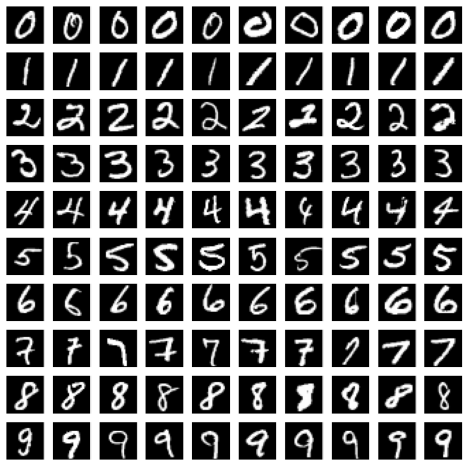

# mnist-cnn

## Convolutional neural network(CNN) in classical mnist dataset

- 99.345% accuracy

* Layers
  - Conv2D (2 layer, 32 nodes each)
  - MaxPooling2D (1 layer, poolsize=(2,2))
  - Conv2D (2 layer, 64 nodes each)
  - MaxPooling2D (1 layer, poolsize=(2,2))
  - Dense (1 layer, 128 nodes)
  - Dropout (1 layer, .4 nodes)
  - Dense (1 layer, 128 nodes)
  - Dropout (1 layer, .4 nodes)
  - Dense Output (10 nodes)

# Sample image of dataset

